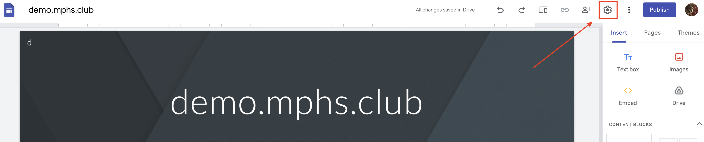

## Why

Once you setup a google site for your club, the included domain will look something like: "sites.google.com/view/myersparkicc". There's nothing wrong with this, but if you follow the steps below, you'll have a domain like "icc.mphs.club," which is pretty cool!
## How

#### Google Site
Open your google site in edit mode. Click on the settings cog in the top right.

Now, click on "Custom domains", followed by "Start setup"

In the setup menu, there will be two boxes. In the first box (on the left), type in your chosen subdomain. In this case, it is "demo", and the final domain for the website will be "demo.mphs.club". In the second box, enter "mphs.club"

After you finish typing your chosen domain, google will prompt you to "verify your ownership", (black arrow points to this link in image above). Click verify.

A new tab will launch taking you to the search console. 

#### Search Console
First, ensure that you are still using the correct google account. Where the blue arrow is pointing in the image below, click on the account icon to double check that google hasn't switched your accounts. If this happens, the process will fail, since the domain property will be verified on a different account!

Ensure that "Domain" is the option as opposed to "URL prefix". And double check the entered domain is the same as the previous step. (The text in the red rectangle). Then click "CONTINUE" (red arrow points to it).

In the next page, first ensure that the dropdown in step 1 (red box surrounds it in image below) says "Any DNS provider". You may have to change it from cloudflare.

Also ensure that the record type (blue box surrounds it in image below) says "TXT (recommended)". 

Once you complete the steps above, click the "COPY" button to copy the TXT record (red arrow points to it in image below).

Do not click "Verify" just yet, however. Leave this page open.

#### Request Portal
Now, go to https://request.mphs.club. A 2000s era webpage will pop up 🤣.

In the first field (red arrow pointing to it in image above), enter your desired subdomain. So in my case, I'll enter "demo", since I would like the "demo.mphs.club" domain.

In the second field, paste your google TXT record that you copied from the previous step.

In the Passcode field, enter the passcode. 

Now click the "Request Subdomain" button.

If you entered the correct passcode, you'll see a success message like the one above. Yay! You can close out of the request website.

#### Back to search console
Back in the search console tab, click the button that says "VERIFY". A red arrow is pointing to it in the image below.

You should see a screen like the one below telling you that your ownership has been verified. Click "DONE"

You may now close out of the search console page. 

#### Back to google sites
Back in the google sites dashboard, it will still ask you to verify the property. Simply refresh the page (again, ensuring you are in the correct google account) and open up the settings menu again. Go back to the "Custom domains" menu (enclosed in red rectangle in image below) and click "Start setup" (in blue rectangle in image below).

Once again, enter your desired subdomain. This time, however, it shouldn't bug you to verify your domain. You should have a checkmark and it will let you proceed to the next step. Click the "Next" button.

You can ignore what the next page says, the request website has handled all of that for you. Click "Done".

#### You're done!
After you click "Done" in the previous screen, your desired domain should be listed under "Connected domains". Lastly, ensure your site is published. 

Congratulations! You now have a cool looking domain for your website. 

You can try going to your new domain name immediately, but it probably won't work for a few hours. In some cases, it may take a full day or two to propagate. 
